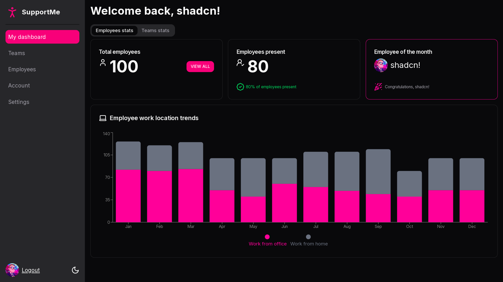

# SupportMe - shadcn/ui Component Showcase



[DEMO](https://nextjs-shadcn-support-me-nzy1.vercel.app/)

## Overview

SupportMe is a demonstration project showcasing the implementation and styling capabilities of shadcn/ui components within a Next.js application. It's structured as an employee dashboard to provide practical context for component usage.

## Purpose

This project serves as a reference implementation for:

- Integration of shadcn/ui components in Next.js
- Component customization and theming
- Responsive design patterns
- Dark/Light mode implementation

## Routes

```
/login
/sign-up
/dashboard
  /account
  /employees
  /settings
  /teams
```

## Featured Components

### Layout Components

- Card
- Drawer
- Tabs
- Avatar

### Form Components

- Input
- Password Input
- Select
- Checkbox
- Label

### Data Display

- Table (using TanStack Table)
- Badge
- Tooltip
- Popover

### Charts

- Bar Chart (Recharts)
- Pie Chart (Recharts)

## Tech Stack

- **Framework**: Next.js 15
- **UI Components**: shadcn/ui
- **Styling**: Tailwind CSS
- **Charts**: Recharts
- **Icons**: Lucide React

## Getting Started

### Prerequisites

- Node.js 18+
- npm/yarn/pnpm

### Installation

```bash
# Clone the repository
git clone https://github.com/yourusername/support-me.git

# Install dependencies
npm install

# Run the development server
npm run dev
```

Open [http://localhost:3000](http://localhost:3000) to view the local development server.

## Project Structure

```
src/
├── app/
│   ├── (logged-out)/     # Login/Signup component examples
│   ├── dashboard/        # Main component showcase
│   └── layout.tsx        # Root layout with theming
├── components/
│   └── ui/              # shadcn/ui components
└── lib/                 # Utilities
```

## Theme Customization

The project demonstrates theme customization through:

- Custom color palette in `tailwind.config.ts`
- Dark/Light mode toggle
- Component style overrides

